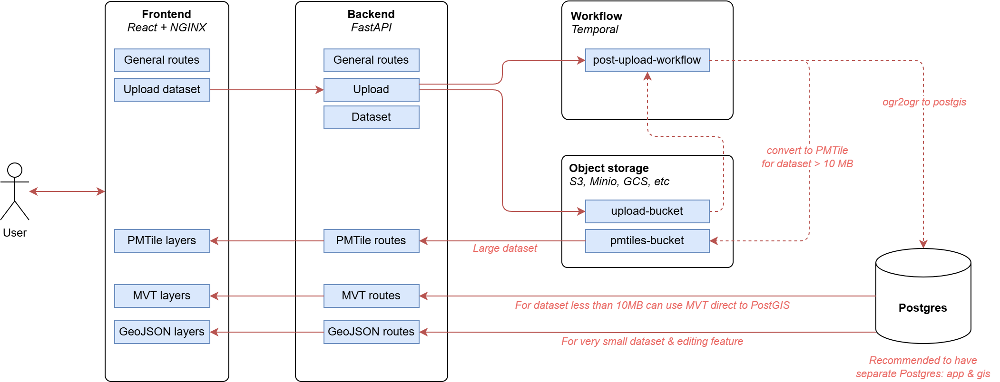

# Fullstack App – Vite + shadcn/ui + FastAPI

A modern, fullstack web application built to showcase real-world architecture, clean code practices, and a seamless developer experience. Powered by **Vite** and **shadcn/ui** on the frontend, and a **FastAPI** backend, this app is designed for rapid development, performance, and scalability.



---

## Quickstart (Docker Compose)
Run this command (make sure `docker` is installed)
```bash
docker compose build
docker compose up -d
```


For development
```bash
docker compose -f docker-compose.dev.yml up -d

# start backend development server
cd backend
poetry install --no-root
poetry run alembic upgrade head
poetry run python src/scripts/load_demo_data.py
poetry run fastapi dev src/main.py

# Backend available at http://localhost:8000

# start frontend development server
cd frontend
pnpm install
pnpm run dev

# Frontend available at http://localhost:5173/
```

## 🚀 Features

### 🔐 Authentication

- ✅ **Basic Auth**: Standard email & password authentication with hashed credentials and JWT-based session management.
- 🛠️ **Magic Link Login** *(planned)*: Email-based login without the need for passwords.
- 🔒 **2FA Support** *(planned)*: Time-based One-Time Passwords (TOTP) with QR code setup.
- ❌ **OAuth2** *(planned)*

### 🎨 Frontend (Vite + shadcn/ui + Tailwind)

- ⚡ Ultra-fast dev experience with Vite HMR
- 💅 Beautiful, accessible UI components via [shadcn/ui](https://ui.shadcn.com/)
- 🎨 Fully themed with TailwindCSS & dark mode support
- 🧹 Auto-formatting with [Prettier](https://prettier.io/)
- 🧪 Unit-tested components using Vitest & Testing Library

### 🧠 Backend (FastAPI + SQLModel)

- ⚡ High-performance Python backend with FastAPI
- 🔐 Auth system with JWT, dependency overrides, and secure password hashing
- 📄 RESTful APIs and OpenAPI docs auto-generated
- 🧰 Database modeling with SQLModel (SQLite/PostgreSQL)
- 🔄 Background tasks (IN PROGRESS)
- 🧪 Pytest test suite with coverage reports (IN PROGRESS)
